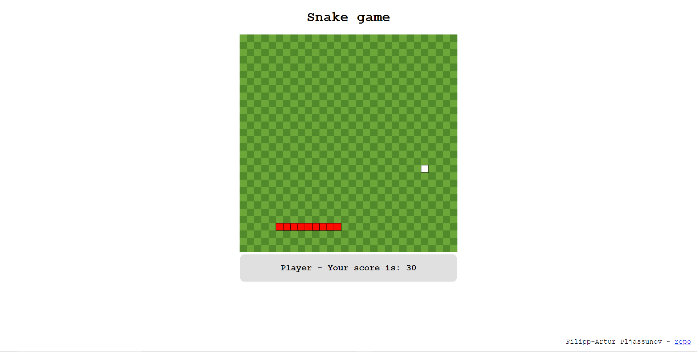

# 2-kodutoo

2. kodutöö Eesrakenduste arendamises - Ussimäng

## Ussimäng
Autor - Filipp-Artur Pljassunov

## Funktsionaalsus

* Mängu alguses kasutaja sisestab nimi
* Mängija kontrollib ussi nooole klahvidega
* Mängija sööb ussiga toitu, mille eest saab punkte
* Kokkupõtge juhul saab mägnu uuesti alustada